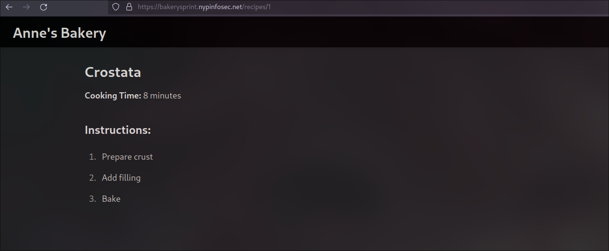
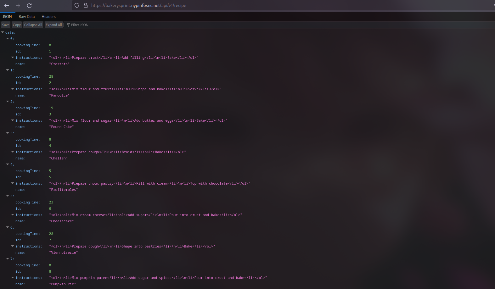

# Bakery Sprint

This challenge is a bit special with 2 flags and 2 different attack vectors.

## Context

Anne has 100 recipes posted on her website.


Clicking on any one of the recipes, shows the steps to make it.



There is also user logins


## Flag 1

Each recipe's page follows the syntax `/recipes/<recipie-id>`.
This is a simple `directory traversal attack`.

### 1a. You can manually change the recipe-id in the URL

Iterate the URL

```text
/recipe/1
/recipe/2
...
/recipe/100
```

This is slow however, because there is 100 recipies to iterate through.

### 1b. Following RESTful API principals

You can discover that the endpoint `/api/v1/recipe` exists.
Sending a GET request returns all the recipies.



### 2. Find the missing ID

Looking at the IDs, you can discover that id 43 is skipped over.


### 3. Navigate to /recipes/43

The rendered page doesn't give us much, but looking at the HTML gives us the flag.


Flag: `NYP{hEymySEcr37ReCIpI35m@n}`

## Flag 2

This is part uses `session hijacking`.

### 1. Creating a new user

We create a user account ourselves to discover how session/authentication works.

### 2. Identify user accounts not using JWT signing

Notice that a cookie called `user_id` is used to identify which user is logged in.


### 3. Find users endpoint

On the `/login` page, notice that there is a random HTTP PUT request to `/api/v1/user` which returns code `405`.

405 response means that the method is not allowed, and does not necessarily mean that the route is invalid.


### 4. HTTP GET to `/api/v1/user`

The endpoint returns all the users, including their admin status. It's anne's Bakery so lets grep for `anne`.


### 5. Edit user_id cookie

Replace the user_id cookie with the value `8`.

### 6. Navigate to /profile


Flag: `NYP{nOWiOwn4L17heREC1P1E5}`
